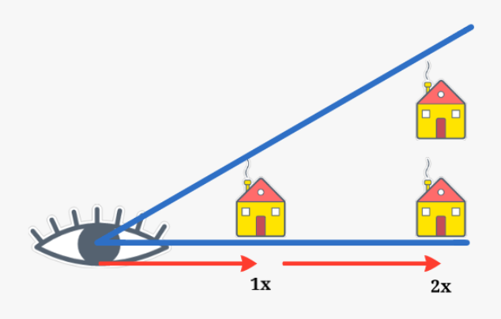
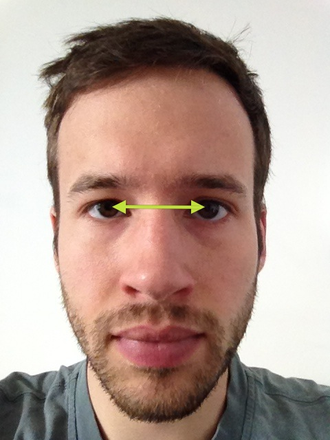
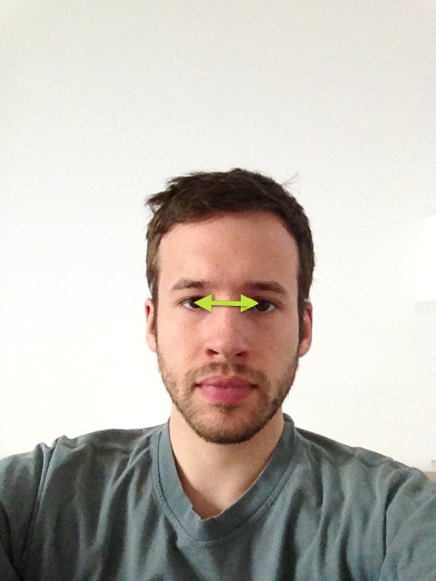

Android-Screen-to-Face-Distance-Measurement
===========================================

Calculate the distance between your smartphone screen and your face using the front facing camera. The idea is pretty simple and best explained in an image.

An object or a "distance" will seem smaller once its further away from the camera than when its closer to it. So one should be able to calculate the distance between camera and face while using the eye distance at a reference length, in our case 29.7cm (the length of an A4 paper), and multiplying the reference length with the change of eye distance.

Close: 

Far:

For a video showing its awesomeness 
https://www.youtube.com/watch?v=-6_pGkPKAL4
